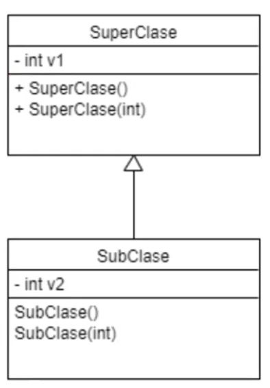
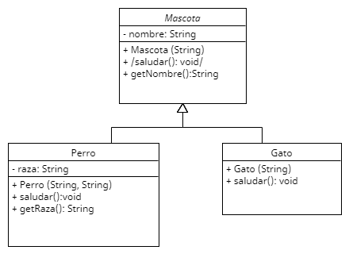
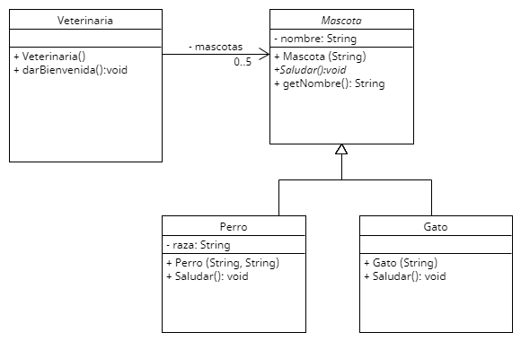
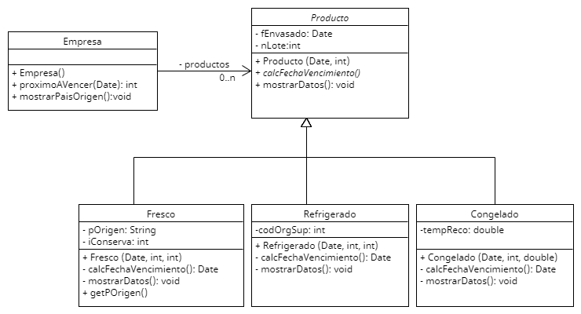

Variables tipo puntero :
Objetos, String, Integer, Double, Boolean

Variables que guardan espacio en memoria:
int, double, boolean, char

##### Herencia

- Se instancia objetos en las sub clases.
- Lo heredado esta encapsulado en la superclase, esta a otro nivel.
- Desde la subclase puedo ingresar a todo lo que sea publico de la superclase. No puedo ingresar a lo que esta privado de la superclase por mas que herede de la misma.
- Desde la super clase no puedo ingresar a ninguno de los metodos/atributos de la subclase por mas que sean publicos porque no se cual de todas las subclases voy a estar llamando. (como tiene muchas clases hijas, no conoce con que se va a encontrar al llamar un metodo, capaz llama a una subclase que no tiene ese metodo).

###### Metodos heredados // Redefiniendo Metodo // Override:

- La superclase explota el metodo con los atributos que tiene **(.metodoX())**.
- Las subclases **primero** van a llamar a la funcion de la superclase **(super.metodoX())** y terminan de explotar ese metodo con los atributos de la propia subclase.

Para que se redefine un codigo:

- Reemplazar en la subclase la funcionalidad del metodo de la super clase.
- Agregar funcionalidad al metodo de la super clase. (siempre se debe invocar al metodo de la superclase anteponiendo la palabra **super SOLO EN ESTE CASO**).

###### Constructor en herencia:

- Cuando creamos un constructor con parametros se pierde el constructor por default, si queremos q se mantenga lo tenemos q agregar tambien.
- El constructor no se hereda.
- Al instanciar un objeto se ejecutaran automaticamente los contructores por default de toda la jerarquia de la clase, comenzando por el de la clase de mayor jerarquia. Esten definidos o no. Si no estan difinidos sera el default y sino el que hayamos escrito. Si no queremos que esto suceda debemos indicar explicitamente que constructor queremos que se ejecute.

Cuando instanciamos un objeto de la sub clase: primero se construye la super clase y luego la sub clase.

Cuando tenemos un constructor de la superclase con parametros debemos llamarlo desde la subclase con la palabra **super**, debe ser la primer instruccion del metodo.



```java
public SubClase(int valorv1, int valorv2){
super(valorv1);
this.v2 = valorv2;
}
```

##### Metodos Abstractos:

- Son metodos incompletos que no estan explotados/no tienen implementacion, para crearlo hay que usar la palabra **abstract sin los {}**.

```java
 public abstract void algunMetodo();
```

- En UML se indica entre `"/nombreMetodo/"`

##### Clases Abstractas:

- Contieme uno o mas metodos abstractos.
- No se puede instanciar. (No se puede crear un objeto del mismo)
- Solo se puede utilizar para heredar tanto a otras clases como a interfaces.
- En UML se indica entre `"/NombreClase/"`
- Se declara con la palabra abstract

```java
 abstract class unaClase{...}
```

- Las clases que heredan de una clase abstracta **deben implementar/explotar los metodos abstractos obligatoriamente, su implementacion va a ser diferente en cada subclase que herede, o la otra opcion es que sean clases abstractas para no implementarlos**
- Se puede declarar una clase abstracta aun cuando no tenga ningun metodo abstracto.
- Puede incluir atributos y metodos NO abstractos.

**Cuando una clase hereda de otra hay que poner en codigo la palabra extends(SuperClase)**.
JAVA NO PERMITE HERENCIA MULTIPLE.

```java
public class Triangulo extends Figura { // Triangulo indica que es una subclase de Figura con el extends.
private int base, altura;

public Triangulo(String nombre, int ba, int al){ // Triangulo es subclase de Figura, en su constructor manda el parametro nombre al constructor de figura.
  super(nombre);
  this.base = ba;
  this.al = al;
}

public double calcularArea() {
  return this.base * this.altura/2;
}
}
```

---

##### Interfaces

- En el UML se indica asi: `/<<NombreInterface>>/`
- No podemos crear instancias de ella
- **Todos los componentes son publicos** (no hay necesidad de declararlos publicos).
- **Todos los metodos son abstractos** (no requiere declararlos como abstract).
- **Todos los atributos son STATIC y FINAL. Se usa para definir valores constantes**. En UML se indican: `_+ IVA=21_`

No continenen implementacion ni datos.
**No heredan de otras clases pero si permite heredar de otras interfaces.**
No permite declarar variables.
Obligan herencia e implementacion de metodos y propiedades en las clases derivadas.
Una clase puede implementar multiples inferfaces.

---

#### Polimorfismo

Propiedad por la que es posible enviar mensajes (invocar metodos) sintacticamente iguales (con el mismo nombre y parametros) a objetos de distinta clase y que respondan distinto (que tengan logica distinta).

Los objetos deben saber responder al mensaje que se les envia: Para que el objeto pueda responder al mensaje, la clase debe contener le metodo (mensaje).Para garantizar que dos clases distintas contengan el mismo metodo, debemos hacer que estas lo hereden de una clase superior o lo implementen desde una interfaz.



Toda clase que herede de mascota va a tener que tener el metodo saludar() implementado con codigo.

##### UpCasting

Es la posibilidad de tratar a un objeto de una subclase como un objeto de la superclase.
Esto se logra apuntando a un objeto de una subclase con un puntero de la superclase:

```java
Perro fido;
Mascota a;
fido = new Perro ("Fido", "Bull Dog");
a = fido;
```

El puntero a de la superclase Mascota apunta al mismo objeto al que apunta fido que es un puntero de la subclase Perro. (Upcasting).

Tras haer el upcasting (a) unicamente podemos acceder a los atributos y metodos pertenecientes a la superclase, ya no a los que son unicos de la clase Perro.

```java
a.getNombre(); // Puede usar a .getNombre porque es un metodo de la propia clase Mascota.

a.getRaza(); // Pero no puede usar / no puede ver a .getRaza porque ahora es un puntero de tipo Mascota que solo puede usar los metodos y atributos de esa clase.

// Sin embargo el puntero fido si va a poder ingresar a los metodos .getNombre() porque es publico de la super clase y a su propio metodo .getRaza porque su puntero sigue siendo de clase Perro.

fido.getNombre();

fido.getRaza();

```

**La subclase puede ingresar a los metodos publicos de la super clase como los getters, si fueran privados si o si tenemos q hacer el upcasting**

##### DownCasting

- Es la posilidad de volver a tratar el objeto con un punto de la clase a la que pertenece.
- Se utiliza para volver a **acceder a todos los atributos y metodos de la clase a la que pertenece**.
- A diferencia del upcasting **siempre se hace indicando cual es la subclase**

```java
Mascota a = new Perro ("Fido", "Bull Dog"); // Upcasting
Perro p;
p = (Perro) a; // DownCasting, indico que el puntero a se va a convertir en perro: (Perro) a, y ahora el puntero p de tipo Perro va a apuntar a ese objeto en memoria.
p.getRaza(); // Ahora podemos usar los metodos/atributos que son exclusivas de la clase Perro.
```

###### Instanceof

A fin de evitar un error debido a que la clase a la que pertenezca el objeto no coincida con la clase del puntero, siempre usamos **intanceof**.

```java
if (a instanceof Perro) { // Si a (puntero de la superclase) contiene una instancia de Perro.
 p = (Perro) a; // Hace el downcasting hacia el puntero de la clase Perro.
 p.getRaza(); // Y ejecuta el metodo que le pertenece exclusivamente a la clase Perro.
}
```



```java

// Super clase
public Mascota (String nombre){
  this.nombre = nombre;
}

// Ejemplo de constructor subclase de Mascota
public Perro (String nombre, String raza){
  super(nombre); // Parametro que va al constructor de la superclase.
  this.raza = raza;
}

// Sub clase Perro
public void saludar () {
System.out.println("Guau")
}


// Sub clase Gato
public void saludar () {
System.out.println("Miau")
}

// Clase: Veterinaria
public void darBienvenida() {     // For each
for (Mascota mascota: this.mascotas) { // Ya esta impolementado el saludar en las subclases, y la lista de mascotas tiene perros y gatos upcasteados.
    mascota.saludar() //  EJEMPLO DE POLIMORFISMO: Al ser un metodo abstracto, ejecuta el metodo saludar de la instancia de este objeto contenido en el puntero de la superclase sea un gato o un perro.
}
}

public void mostrarRazas(){
  Perro p;
  for (Mascota mascota: this.mascotas){
    if (mascota intanceof Perro) { // Instance of y Downcasting:
      p = (Perro) m; // Se aclara que tipo de instancia es la que se va a guardar en p
      p.getRaza(); // Ahora p puede usar los metodos propios de la subclase Perro.
    }
  }
}
```

---

## PARTE PRACTICA

```
Enunciado:

Una empresa agroalimentaria trabaja con 3 tipos de  productos: frescos, refrigerados y congelados.
Todos los productos llevan esta información común: fecha de envasado y número de lote.
A su vez, cada tipo de producto lleva alguna información  específica.
Los productos frescos deben llevar el país de origen y el índice de conservación.
Los productos refrigerados deben llevar el código del organismo de supervisión alimentaria.
Los  productos congelados deben llevar la temperatura de congelación recomendada.

Existe un gran depósito donde están  almacenados todos los productos a  comercializar.
Las fórmulas para calcular la fecha de vencimiento de cada producto son:

- Frescos: Fec.Env + 3 * índice de conservación.
- Refrigerados: Fec.Env. + 10.
- Congelados: Si la Temp.Cong. Es < 10: Fec.Env + 12; sino + 20.

Consigna:

- Realizar el diagrama de clases para representar el modelo planteado
- Preveer un método constructor para las clases que así lo requieran.
- Todos los productos deben tener un método llamado mostrarDatos que permita mostrar todos sus atributos.
- Desarrollar un método que calcule y  devuelva la fecha de vencimiento de cada producto.
- Desarrollar un método que muestre el país de origen solo para los productos frescos almacenados en el depósito.
- Desarrollar un método que dada una fecha, devuelva la cantidad de productos almacenados que se vencen ese día.

```

UML:



Observaciones:

- **El metodo calcular fecha vencimiento es abstracto porque obligo a todas las clases hijas de producto a que lo implementen, y en el enunciado indica que esa explotacion va a ser distinta en en todas las subclases**

- **No puedo poner mostrar datos en forma abstracta porque necesito usar las variables fEnvadado en uno y en otro los atributos que tiene la superclase para explotarlos, ademas el codigo es el mismo. En todo caso se redefinen en las subclases. (Aplicamos polimorfismo)**

Codigo metodo mostrarDatos():

```java
//Super clase Producto
public void mostrarDatos(){
  System.out.println(this.fEnvasado);
  System.out.println(this.nLote);
}

//Sub clase Fresco
public void mostrarDatos(){
  super.mostrarDatos();
  System.out.println(this.pOrigen);
  System.out.println(this.iConserva);
}

//Sub clase Refrigerado
public void mostrarDatos(){
  super.mostrarDatos();
  System.out.println(this.codOrgSup);
}

//Sub clase Congelado
public void mostrarDatos(){
  super.mostrarDatos();
  System.out.println(this.tempReco);
}
```

Codigo metodo calcFechaVencimiento()

```java
//Sub clase Fresco
// Frescos: Fec.Env + 3 * índice de conservación.
public Date calcFechaVencimiento () {
 return (this.getFEnvasado() + 3 * this.iConserva());
}

//Sub clase Refrigerado
// Refrigerados: Fec.Env. + 10.
public Date calcFechaVencimiento () {
 return (this.getFEnvasado()+ 10);
}

//Sub clase Congelado
// Congelados: Si la Temp.Cong. Es < 10: Fec.Env + 12; sino + 20.
public Date calcFechaVencimiento () {
 Date fecha;
 if (this.tempReco < 10){
   fecha = this.getFEnvasado() + 12;
 } else {
   fecha = this.getFEnvasado() + 20
 }
  return fecha;
}
```

Codigo metodo mostrarPaisOrigen()

```java
//Clase Empresa
public void mostrarPaisOrigen(){
  Fresco f;
  for (Productos p: this.productos){
    if (p instanceof Fresco){
      f = (Fresco) p;
      System.out.println(f.getPOrigen());
    }
  }
}
```

Codigo metodo proximoAvencer()

```java
//Clase Empresa
public void proximoAvencer(Date date){
  int seVencen = 0;
  for (Productos p: this.productos){
    if (p.calcFechaVencimiento() == date){
      seVencen ++;
    }
  }
  return seVencen;
}
```
